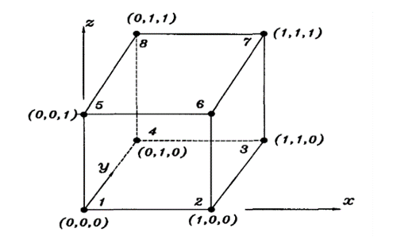
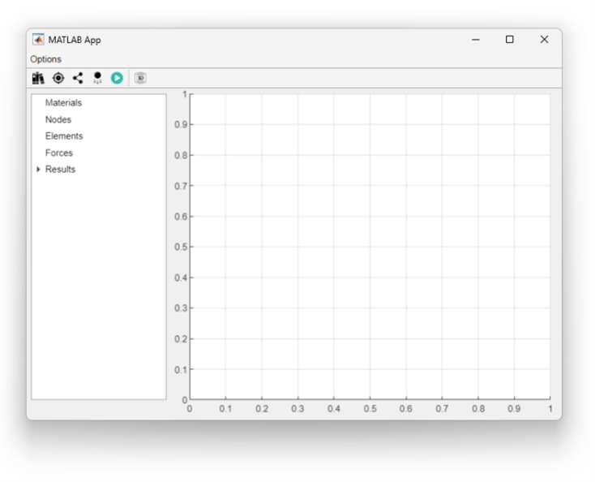
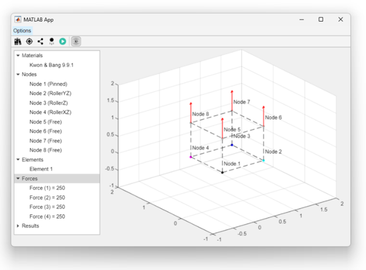
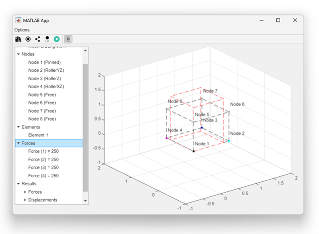

# Static Structural Analysis with Finite Elements Method (FEM)

The current project was developed focusing on the application of the Finite Element Method (FEM) in Static Structural Analysis. It was designed using the Object-Oriented Programming (OOP) paradigm and the AppDesigner tool provided by MATLAB.

## Overview
This project caters to the needs of mechanical engineering students by providing a comprehensive solution for static structural analysis. Utilizing MATLAB and AppDesigner, it offers a user-friendly interface and robust functionality.

## Key Features
- **Object-Oriented Design:** Utilizes OOP principles for efficient code organization and maintenance.
- **AppDesigner Interface:** Developed with MATLAB's AppDesigner tool for a user-friendly interface.
- **Static Structural Analysis:** Capable of performing **simple** static structural analysis using the FEM, including results as stress, displacements and reaction forces.
- **Flexibility:** This project offers easy integration of both 2D and 3D elements, thanks to the OOP. This enables the utilization of various element types within the same problem, enhancing overall flexibility and adaptability.

## Installation and Usage
1. Ensure you have MATLAB installed on your system.
2. Clone the repository to your local machine.
```
git clone https://github.com/Nyfeu/MEF_AnaliseEstrutural.git
``` 
3. Open MATLAB and navigate to the cloned directory.
4. Open the main APP (application > controller > gui > MainView.mlapp) and press RUN (or F5) using MATLAB's AppDesigner.

## File Structure
- **application:** This directory contains all the program files.
- **controller:** This directory includes both UI (User Interface) and GUI (Graphical User Interface) scripts and views.
- **model:**
  - **entities:** This directory contains the definitions of each type of element and geometrical entities.
  - **services:** This directory contains the solver, settings, and error message definitions.

## Case Study
### Element HEX8

There will be presented a problem using hexahedral element (with 8 nodes) which will be solved using this app. The problem to be described is problem 9.9.1 from Kwon & Bang (2018), which considers a cube with 1 meter edge length and a total force of 1000 kN applied in the Z-axis orientation - as shown in the figure below. The primary objective is to obtain the displacements and global forces.

</br>
<div align="center">
  
</div>
</br>

Notice that the resultant force will be equally divided among the four top nodes. Therefore, wich node will have an applied force of 250 kN magnitude. The connectivity matrix is shown in table below:

| Element number | Node $i$ | Node $j$ | Node $m$ | Node $n$ | Node $o$ | Node $p$ | Node $q$ | Node $r$ |
|----------|----------|----------|----------|----------|----------|----------|----------|----------|
| 1 | 1 | 2 | 3 | 4 | 5 | 6 | 7 | 8 |

Having recognized the model, it's now possible to proceed with the problem. The next step is to apply the developed software to the problem. When its main view opens, there will be a window like the one shown below:

</br>
<div align="center">
  
</div>
</br>

In this interface, all possible settings and data are available. It´s necessary to change the mode to three-dimensional analysis (3D) in order to use the HEX8. For that, simply press the "Toggle 2D/3D" button.

Pressing the first icon (*Add material*) it's possible to add a material to the problem. It's also possible to right-click the "Material" item on the left tree and select the "Add material" action from the context menu. Then, the material will be defined in terms of its name, elasticity modulus (E) and Poisson's ratio ($\nu$).

Then, when the "Add Node" button or action is selected, the user can add an ordered triple (X,Y,Z) - denoting the node's position, as well as configure the type of constraint existing at that node, which can be: Free; RollerX; RollerY; RollerZ; RollerXY; RollerXZ; RollerYZ; and Pinned.

Now, the next step is to add the element itself, the HEX8. To do so, press the "Add Element" button or select the "Add Element" action from the left tree. Then, the forces can be added. It's necessary to define the orientation, direction, and magnitude, as well as the node at which the force is applied.

With the problem completely set up, the interface will look as shown by the figure bellow:

</br>
<div align="center">
  
</div>
</br>

Finally, the button "Run Model (Calculate)" can be pressed, or, as with the previous buttons, it can be initiated from the context menu of the "Results" item on the left tree. Then, the displacement results will appear graphically where the model was previously displayed - the displacements are merely illustrative. Additionally, the forces can be viewed in the left tree under the "Results" item.

</br>
<div align="center">
  
</div>
</br>

## Bibliography
- KATTAN, Peter I. MATLAB guide to finite elements: an interactive approach. Springer Science & Business Media, 2010.
- KWON, Young W.; BANG, Hyochoong. The finite element method using MATLAB. CRC press, 2018.
- LOGAN, Daryl L. A first course in the finite element method. Thomson, 2011.
